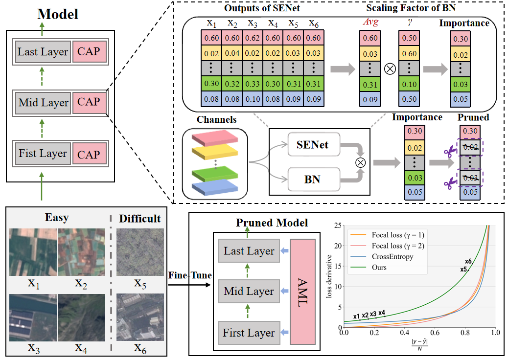

<div align="center">

## RemoteTrimmer: Adaptive Structural Pruning for Remote Sensing Image Classification

[Guanwenjie Zou (邹广文杰)*](https://multimodality.group/author/%E9%82%B9%E5%B9%BF%E6%96%87%E6%9D%B0/) 
, &nbsp; &nbsp;
[Liang Yao (姚亮)*](https://multimodality.group/author/%E5%A7%9A%E4%BA%AE/) 
, &nbsp; &nbsp; 
[Fan Liu (刘凡)](https://multimodality.group/author/%E5%88%98%E5%87%A1/) ✉ 
, &nbsp; &nbsp;
[Chuanyi Zhang (张传一)](https://ai.hhu.edu.cn/2023/0809/c17670a264073/page.htm) 
, &nbsp; &nbsp; 

Xin Li (李鑫)
, &nbsp; &nbsp; 
[Ning Chen (陈宁)](https://multimodality.group/author/%E9%99%88%E5%AE%81/) 
, &nbsp; &nbsp; 
[Shengxiang Xu (徐圣翔)](https://multimodality.group/author/%E5%BE%90%E5%9C%A3%E7%BF%94/) 
, &nbsp; &nbsp; 
[Jun Zhou (周峻)](https://experts.griffith.edu.au/7205-jun-zhou) 


</div>


### News

- **2024/07/29**: We propose an efficient structural pruning method for remote sensing image classification. Codes and models will be open-sourced at this repository.


### Contact
Please Contact yaoliang@hhu.edu.cn

### Installation
Our pruning method utiles the torch-pruning framework, which is compatible with both PyTorch 1.x and 2.x versions.
```py
pip install torch-pruning
```

### How It Works
We leverage intermediate outputs from SENet and scaling factors from the BN layer to map channel importance into the attention space. During the post-pruning fine-tuning phase, we design a lateral inhibition loss function to emphasize difficult samples. Our method effectively addresses two key challenges in remote sensing model pruning: the lack of distinct channel importance and the prevalence of difficult samples.
<div align=center>  </div>

### A Example of Our Method
loading resnet18 model with SENet
```py
import torch
from resnet18_SE.py import resnet18_SE

model = resnet18_SE(class_num) # class_num is the number of types of datasets
```

training model on EuroSAT datasets
```py
python train.py
```

extracting the intermediate outputs of SENet
```py
python get_attention.py
```

deleting SENet upon resnet18 and updating BN layer parameters
```py
python delete_SE_resnet18.py
```

pruning model
```py
python pruning.py
```

fine-tuning pruned model with Adaptive Mining Loss function
```py
from Adaptive_Mining_Loss import MyLoss

loss_fn = MyLoss(r1=1, r2=1)
```

